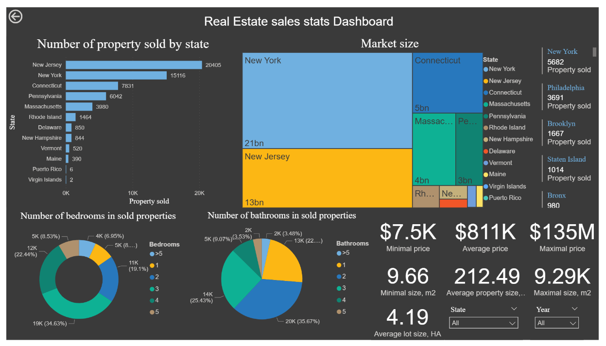
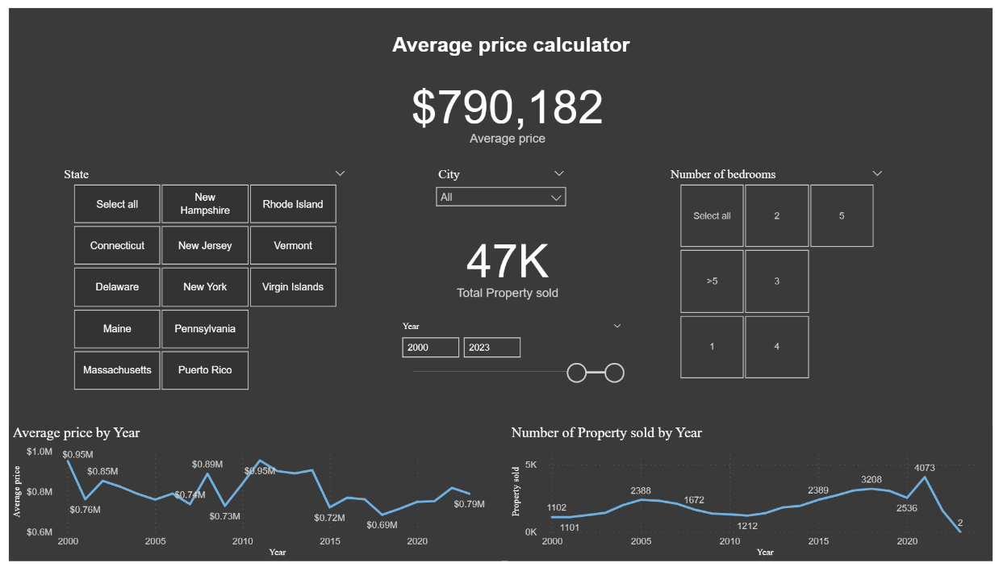
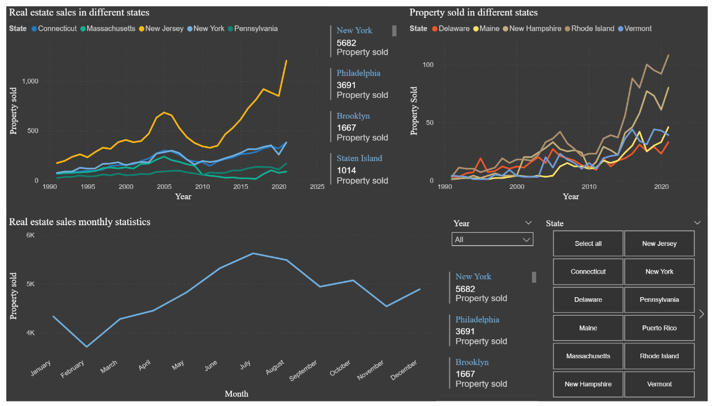

# US Real Estate Market Analysis — SQL + Power BI

**Where should a multi-state brokerage prioritize its market presence, and when should it staff up?**
An end-to-end analysis of ~57K sold-property records across 12 US states/territories, from raw Kaggle data cleaned in SQL to a set of decision-ready Power BI dashboards.



---

## Business context

A regional real estate brokerage (or investor) expanding across the US Northeast needs to answer three practical questions before allocating budget and headcount:

1. **Where** is transaction volume and dollar value concentrated?
2. **What** does the typical sold property look like (size, bed/bath count, price range), so marketing and listing templates match the actual market?
3. **When** in the year does demand peak, so staffing and ad spend can be timed to it?

This project answers those questions using a public Kaggle real-estate dataset, cleaned and modeled in SQL (MySQL), then explored and visualized in Power BI.

## Key insights

- **Volume vs. value diverge by state.** New Jersey leads on transaction count (20,405 sold properties) but New York generates the largest total market value (~$21bn vs. NJ's ~$13bn) despite ~26% fewer sales — NY's average price per property is meaningfully higher, making it the higher-margin market of the two.
- **Demand is concentrated in 5 states.** New Jersey, New York, Connecticut, Pennsylvania, and Massachusetts together account for the large majority of all tracked sales; the remaining 7 states/territories are long-tail markets.
- **The core product is a mid-size home, not a mansion.** 2–3 bedroom homes make up ~57% of all sales, and 2–3 bathroom homes make up ~61%. Average sold price is $811K on a mean size of ~212 m², but the range is extreme ($7.5K to $135M), so median-based or segment-based pricing is more reliable than the mean for any single market.
- **Sales are seasonal.** Monthly volume dips in February (~3.8K) and peaks in July–August (~5.8K), a ~50% swing — a clear signal for when to time listing pushes and staffing.
- **Growth is recent and state-specific.** New Jersey's sales volume rose sharply after 2010 and again accelerated in the most recent years, a different trajectory than the flatter, smaller-state group (Delaware, Maine, New Hampshire, Rhode Island, Vermont), where Rhode Island has recently pulled ahead of its peers.
- **Average price hasn't trended cleanly upward.** Year-over-year average price fluctuates between ~$0.69M and ~$0.95M from 2000–2023 rather than rising steadily — a reminder that this average blends very different sub-markets and isn't a reliable stand-alone growth indicator.

## Recommendations

- **Prioritize NJ and NY for market entry/expansion** — together they represent the largest combined pool of both volume and dollar value.
- **Treat NY as the premium play** — with fewer transactions but disproportionately higher total value, it's the market to prioritize for higher-margin service tiers.
- **Build core marketing/listing templates around 2–3BR / 2–3BA homes**, since that's where most of the transaction volume actually sits, rather than optimizing for outlier luxury listings.
- **Shift staffing and ad spend toward Q2–Q3**, ahead of the July–August peak, and scale back in Q1.

## Dashboards

**1. Sales stats overview** — property count and market size by state, bed/bath mix, and headline price/size stats with state and year filters.


**2. Average price calculator** — an interactive tool to pull average price and sales volume by state, city, bedroom count, and year; built for ad-hoc "what does a typical property cost here" questions.


**3. Trends & seasonality** — year-over-year sales trends by state and month-over-month seasonality, to support timing decisions.


> Full interactive file: [`Real_Estate_USA_Dashboards.pbix`](Real_Estate_USA_Dashboards.pbix) (requires Power BI Desktop)

## Data & methodology

**Source:** Public real estate listings dataset (via Kaggle), covering the US Northeast and territories, including both active listings and historical sales.

**1. Data cleaning (SQL / MySQL)** — [`data_cleaning.sql`](data_cleaning.sql)
- Removed exact duplicates, which cut the raw table down to roughly a ninth of its original size.
- Standardized data types (bed/bath cast to integer, zip code to string) and dropped a `ready_to_build` status segment (277 rows with no sale history, since they're not yet built structures).
- Dropped 6 states with negligible sample sizes (≤7 rows each: Virginia, Georgia, South Carolina, Tennessee, Wyoming, West Virginia) to avoid noisy per-state averages.
- Standardized inconsistent city naming (e.g., "New York City", "Nyc", "Ny" → "New York") and manually imputed 11 missing city values using street-level lookups.
- Corrected clear data-entry errors by cross-checking against realtor.com — e.g., a listing recorded at $875M was corrected to $850K, and a record showing 123 bedrooms/123 bathrooms was corrected to a realistic 8 bed / 10 bath.
- Removed 51 rows with prices under $5,000 (likely erroneous or non-arm's-length transfers).
- Converted units for broader readability: acres → hectares, square feet → square meters.
- Resolved near-duplicate listings that differed only in street-name formatting, using a `ROW_NUMBER()` window function partitioned on the property's core attributes.
- Split the cleaned data into three purpose-built tables: a full property table (cross-sectional analysis), a sold-only table with valid sale dates (time-series analysis), and a vacant-land table (records with no structure, i.e. plots).
- Rebuilds a table from itself several times (e.g. standardizing types, then later re-deriving columns); since MySQL can't overwrite a table from itself in a single statement, those steps go through a temp table and a rename rather than an in-place replace.

**2. Exploration (SQL / MySQL)** — [`exploring_data.sql`](exploring_data.sql)
- Aggregated by state, city, year, month, bedroom count, and bathroom count to surface volume, price, size, and lot-size distributions.
- Built the two query outputs used directly in Power BI: [`queried_data_property_sold.csv`](queried_data_property_sold.csv) (state/city/year/bed/bath level) and [`queried_data_year_and_month.csv`](queried_data_year_and_month.csv) (adds monthly granularity for seasonality analysis).

**3. Visualization (Power BI)**
- Modeled the two query outputs and built 3 dashboards (above) with cross-filtering by state, city, year, and bedroom count.

## Repository structure

```
├── README.md
├── data_cleaning.sql                      # Deduplication, type fixes, error correction, table splits (MySQL)
├── exploring_data.sql                     # Aggregation queries powering the Power BI model (MySQL)
├── queried_data_property_sold.csv         # Query output: state/city/year/bed/bath aggregates
├── queried_data_year_and_month.csv        # Query output: adds monthly granularity
├── Real_Estate_USA_Dashboards.pbix        # Interactive Power BI file
├── Real_Estate_USA_Dashboards.pdf         # Static export of all 3 dashboards
└── assets/                                # Dashboard screenshots used in this README
```

## Tools & skills

`SQL (MySQL)` · `Power BI` · Data cleaning & deduplication · Data quality auditing (outlier detection, cross-referencing external sources) · Aggregation & window functions · Dashboard design · Business insight framing

## Limitations & notes

- The dataset mixes active listings and historical sales; not all records have a valid `sold_date`, so time-series views use a filtered subset of the full data.
- Average price is sensitive to extreme outliers even after cleaning (max $135M); segment-level or median figures are more reliable for market-level decisions than the blended average.
- This is a public/historical dataset used for skills demonstration — figures reflect the dataset's coverage window, not necessarily the current market.
